<div align="center">


# KnowledgeDiver

**Type a keyword. It searches, crawls, writes cards, and links them into a graph.**

Local-first: the cards, the embeddings and the vector index all stay on your machine.

[](LICENSE)
[](https://www.python.org/)
[](https://nodejs.org/)
[](#faq)
[](https://github.com/TC635807/KnowledgeDiver/stargazers)

**English** · [简体中文](README.md) · [Live demo](https://knowledgediver.cloud) · [Quick start](#quick-start) · [How it works](#how-it-works)

[](https://knowledgediver.cloud)

</div>

## What it does

Give it a keyword, or upload a document. It will:

1. find candidate pages using free search engines (Bing / AnySearch / Exa-MCP / DuckDuckGo / SearXNG, no API key required);
2. fetch the page text, preferring a real browser and falling back to trafilatura or plain HTTP;
3. write one card per source with your configured LLM, using the page text rather than a summary;
4. organise the cards into a tree via `parent_id` and add links between related cards;
5. index them with a local embedding model so they can be searched semantically;
6. score every card and compute gap statistics for the whole library;
7. optionally run the agent's `/loop` mode to fill the gaps it finds.

Every card keeps the full page text it was written from, so the source is always one click away.

## Screenshots

| Knowledge graph + Agent assistant | Card tree + card detail |
| --- | --- |
| [](https://knowledgediver.cloud) | [](https://knowledgediver.cloud) |

Quality and gap analysis, with four-dimension scores, a gap histogram, a dimension heatmap, per-card ranking and cluster health:


## Features

**Search and fetching**

- Free multi-engine search with no API key; the engine order is configurable
- Three-tier fetching: crawl4ai / Playwright, then trafilatura, then HTTP + BeautifulSoup
- Results that do not match the query count as a failure, so the next engine is tried
- Checks robots.txt per domain and records domain quality over time
- Documents (txt / md / pdf / docx) are split into root, section and detail cards

**Cards and graph**

- Cards carry a title, a Markdown body, the source URL, tags and the model's confidence
- Tree structure via `parent_id`, plus Obsidian-style undirected links with symmetric backlinks
- Sort by tree / newest / title, browse the vis-network graph, reopen the raw page text behind any card

**Semantic search**

- Local `bge-small-zh-v1.5` embeddings in `sqlite-vec`, 512 dimensions, cosine distance
- New cards are indexed automatically; missing vectors are backfilled at startup
- Falls back to title matching when the embedding model is unavailable

**Quality analysis**

- Four scores per card: structure, graph signals, semantic fit and LLM self-confidence
- Library-wide quality report, weakest-card ranking, gap histogram, dimension heatmap
- HDBSCAN clustering for cluster-level health: weak, fragmented and undercovered topics

**Agent**

- ReAct agent with 13 tools across read, prescription and write layers
- `/loop` mode keeps working on the lowest-scoring cards and clusters
- Runs in the background: refreshing the page or dropping the SSE connection does not cancel it
- Write-layer tools are circuit-broken after repeated failures

**Tasks**

- Every collection, expansion, refresh and document analysis is a Task with SSE progress, card, complete and error events

## Quick start

```bash
git clone https://github.com/TC635807/KnowledgeDiver.git
cd KnowledgeDiver
./start.sh          # Linux / macOS; on Windows use start.bat
```

Open **http://localhost:3000**. The backend runs on `:8000` and the dev UI on `:3000`.

`start.sh` is idempotent and handles the three things that usually get in the way:

1. creates `.env` from `.env.example` and writes a random `JWT_SECRET`;
2. installs dependencies, CPU-only PyTorch first so the 2.7 GB CUDA wheels are skipped;
3. downloads the embedding model `bge-small-zh-v1.5` (about 92 MB, via the hf-mirror mirror by default).

Requires Python 3.10+ and Node 18+. The full install is about 2.8 GB.

Search and fetching need no API key. Card generation and the agent need an OpenAI-compatible endpoint
(`AI_API_URL` / `AI_API_KEY` / `AI_MODEL`); point it at Ollama or another local server.

## How it works

```mermaid
flowchart LR
    KW["keyword / document"] --> SRC["Search sources<br/>free engines · Bocha · Baidu · Exa"]
    SRC --> FETCH["Fetchers<br/>crawl4ai / Playwright → trafilatura → HTTP+BS4"]
    FETCH --> CB["CardBuilder<br/>one card per source, written from the page text"]
    CB --> PERSIST["CardPersister<br/>parent_id tree + undirected links"]
    PERSIST --> EMB["Embedder<br/>bge-small-zh-v1.5 → sqlite-vec"]
    EMB --> EXPL["Explorer<br/>tree · vis-network graph · semantic search"]
    EXPL --> QUAL["Quality and gap analysis<br/>4 scores · histogram · HDBSCAN clusters"]
    QUAL --> AGENT["Agent /loop<br/>fills the gaps it finds"]
    AGENT --> SRC
```



Each stage is an abstract interface, so search sources, fetchers, card builders and embedders can be replaced
without touching the rest of the pipeline.

| Module | Responsibility |
| --- | --- |
| `backend/pipeline/` | Composable pipeline and PipelineAPI |
| `backend/search/` | Search adapters (free multi-engine / Bocha / Baidu / Exa) |
| `backend/scraper/` | Three-tier fetching, robots.txt, domain quality, URL prioritisation |
| `backend/ai/` | LLM calls and the local embedding model |
| `backend/agent/` | Agent tools, loop, background manager |
| `backend/quality/` | Scoring, cluster evaluation, improvement strategies |
| `backend/storage/` | Storage abstraction and the SQLite implementation |
| `frontend/src/` | React UI: card tree, graph, collector, agent drawer, quality panel |

## Configuration

Settings live in `.env` (created from `.env.example`, git-ignored). You can also edit them in the UI:
avatar → API settings. That rewrites the matching lines in `.env` in place and takes effect without a restart.
The API only ever returns masked keys.

| Variable | Default | Notes |
| --- | --- | --- |
| `AI_API_URL` | `https://ollama.com/v1` | Any OpenAI-compatible endpoint; full `/v1/responses` URLs are normalised |
| `AI_API_KEY` | empty | Only needed for card generation and the agent |
| `AI_MODEL` | `deepseek-v4.1-flash` | One model shared by card generation and the agent |
| `AI_CONCURRENCY` | `2` | LLM concurrency limit |
| `DEFAULT_SEARCH_PROVIDER` | `free` | `free` / `bocha` / `baidu` / `exa` |
| `FREE_SEARCH_ENGINES` | `exa-mcp,anysearch,bing,ddg,searxng` | Engine priority, left to right |
| `ANYSEARCH_API_KEY` | empty | Optional, only raises the anonymous quota |
| `BOCHA_API_KEY` | empty | Required only when `provider=bocha` |
| `MAX_CONCURRENT_TASKS` | `5` | Concurrent collection tasks |
| `KD_SERVER_URL` | `https://knowledgediver.cloud` | Optional official server for account, forum and migration |

The default engine order puts `exa-mcp` and `anysearch` first because Bing degrades to searching only the
first word of a multi-word Chinese query. Adjust `FREE_SEARCH_ENGINES` for your network.

## FAQ

**Do I need an API key to try it?** No. Search, fetching, the card tree, the graph and quality analysis all work
without one. Card generation and the agent need an LLM endpoint.

**Can it run offline?** Yes. Point `AI_API_URL` at Ollama, vLLM or LM Studio; the embedding model already runs locally.

**Where is my data?** In the project directory: `data/knowledgediver.db` (users, sessions, domain quality),
`cards/{username}/{session_id}/session.db` (cards, page text, vectors) and `models/bge-small-zh-v1.5/`
(weights). All three are git-ignored.

**Why does `start.sh` install CPU-only PyTorch?** The embedding model only does CPU inference, but the Linux
`torch` wheel on PyPI is a CUDA build that pulls in 16 `nvidia-*` packages (about 2.7 GB, taking the venv from
1.8 GB to 5.7 GB). Set `TORCH_CPU_ONLY=0` if you want the GPU build.

**Why doesn't my shell proxy apply?** Outbound requests use only the proxy you configure explicitly
(`AI_PROXY_URL`, `PROXY_PORT`) and ignore environment variables such as `HTTP_PROXY` and `ALL_PROXY`,
so a stopped local proxy cannot take the AI client and the whole search chain down with it. `socks5://` is
supported through `socksio`.

**Does it respect robots.txt?** Yes. It is checked per domain and cached.

**Is the interface available in English?** Not yet. The UI and the code comments are in Chinese; an English UI is
on the roadmap.

## How it compares

It is not a note editor and not a chat box. The cards and the tree are collected automatically rather than written
by hand, and most of the effort goes into collecting, building the graph and auditing library quality.

The descriptions below are each project's own positioning:

| Project | Their focus | Difference from KnowledgeDiver |
| --- | --- | --- |
| [Reor](https://github.com/reorproject/reor) | "Private & local AI personal knowledge management app" | Reor is for notes you write; KnowledgeDiver is for material it collects |
| [Karakeep](https://github.com/karakeep-app/karakeep) | Self-hostable bookmarking app with AI tagging | Karakeep stores what you already found; KnowledgeDiver goes and searches |
| [Khoj](https://github.com/khoj-ai/khoj) | AI search over your documents and the web | Khoj is question-and-answer oriented; KnowledgeDiver produces editable cards and trees |
| [AnythingLLM](https://github.com/Mintplex-Labs/anything-llm) | Chat with your docs, agents, multi-user workspaces | AnythingLLM centres on chat and workspaces; KnowledgeDiver centres on the graph and library quality |
| [SiYuan](https://github.com/siyuan-note/siyuan) | Privacy-first local knowledge management | Both are local-first; SiYuan is a block editor, KnowledgeDiver builds a graph from collected material |

Check each project's own documentation for the latest details.

## Open-source edition vs the official cloud

Everything in this repository runs on your own machine.

| | This repository | [knowledgediver.cloud](https://knowledgediver.cloud) |
| --- | --- | --- |
| Search, fetching, cards, tree, graph | ✅ | ✅ |
| Semantic search, quality and gap analysis | ✅ | ✅ |
| Agent and `/loop` | ✅ | ✅ |
| Multi-device session sync and migration | — | ✅ |
| Account and community forum | — | ✅ |

The cloud is optional: `KD_SERVER_URL` is the only place that points at it, and leaving it empty gives you a
purely local setup.

This repository is the core edition extracted from the internal full system. It does not include the commercial
modules, built-in keys, or the paper, patent and competition material.

## Development

```bash
cd tests/backend && pytest -v     # backend
cd frontend && npm test           # frontend
```

`backend/` is a FastAPI application. The routes are thin and the logic lives in `pipeline/`, `agent/`,
`quality/`, `scraper/` and `storage/`. `frontend/` is React 18 + TypeScript + Vite.

## Roadmap

- [x] Search → fetch → cards → tree and graph pipeline
- [x] Semantic search on local embeddings
- [x] Quality scoring, gap analysis and cluster diagnostics
- [x] ReAct agent with `/loop`
- [ ] English UI and English documentation
- [ ] More interchangeable search sources and fetchers
- [ ] Obsidian / Markdown import and export
- [ ] Optional GPU embedding backend

Priorities may change; issues are the right place to discuss them.

## Contributing

Issues and pull requests are welcome. The UI and code comments are in Chinese for now, but PRs written in English
are fine, and helping translate the interface is a good first contribution. Small, focused pull requests with a
test are the easiest to merge.

If this project is useful to you, a ⭐ helps other people find it.

## License

MIT, see [LICENSE](LICENSE).
