<div align="center">


# KnowledgeDiver

**Type a keyword. Get a knowledge graph.**

It searches the web for you, reads the actual pages, writes wiki-style cards,
links them into a tree and an interactive graph — then audits that graph
and tells you where it is still thin.

[](LICENSE)
[](https://www.python.org/)
[](https://nodejs.org/)
[](#faq)
[](https://github.com/TC635807/KnowledgeDiver/stargazers)

**English** · [简体中文](README.md) · [Live demo](https://knowledgediver.cloud) · [Quick start](#quick-start) · [How it works](#how-it-works)

[](https://knowledgediver.cloud)

<sub>Card tree · knowledge graph · Agent assistant — click through to the live demo</sub>

</div>

## What it does

Give it a keyword, or drop in a document. It runs the whole loop by itself:

```
keyword / document
      │
  ⓐ   │  multi-engine web search    Bing · AnySearch · Exa-MCP · DuckDuckGo · SearXNG — no API key needed
  ⓑ   │  three-tier fetching         browser rendering → trafilatura → plain HTML, whichever works
  ⓒ   │  card generation             one card per source, written by your LLM from the full page text
  ⓓ   │  organisation                explicit parent/child tree + Obsidian-style undirected links
  ⓔ   │  retrieval                   local embeddings + sqlite-vec, 512-d cosine similarity
  ⓕ   │  audit                       four-dimension quality score → gap score → where the graph is thin
  ⓖ   │  agent                       /loop hunts down the thin spots and fills them on its own
      ▼
a knowledge base you can browse, edit, measure — and grow
```

Every card keeps the **full raw page text** it was written from, so you can always check the source instead
of trusting a summary of a summary.

## Why KnowledgeDiver

- **It starts from a search, not from your files.** Most "AI knowledge base" tools wait for you to upload
  documents. KnowledgeDiver goes out, finds the sources, reads them and files what it learned — one keyword
  and one click produce a populated, cross-linked knowledge base.
- **The output is a graph you can edit, not a chat log you scroll.** Cards land in an explicit parent/child
  tree and are cross-linked Obsidian-style, with symmetric backlinks. The vis-network view makes the shape
  of your knowledge visible at a glance.
- **It measures itself.** Every card gets four scores — structure, graph signals, semantic fit, model
  confidence. The library gets a gap histogram, a dimension heatmap and HDBSCAN cluster diagnostics that
  flag **weak / fragmented / undercovered** topics. "What should I learn next" gets an answer that is not vibes.
- **An agent that maintains the graph.** The ReAct agent ships 13 tools across read / prescribe / write
  layers; `/loop` keeps it iterating on the weakest cards and clusters, and the loop survives closing the tab.
- **Local-first, for real.** SQLite for metadata, one SQLite file per session for cards and raw pages,
  `bge-small-zh-v1.5` running on CPU, `sqlite-vec` for vectors. No account, no telemetry, and the
  official cloud is entirely optional.

## Screenshots

| Knowledge graph + Agent assistant | Card tree + card detail |
| --- | --- |
| [](https://knowledgediver.cloud) | [](https://knowledgediver.cloud) |

**Quality & gap analysis** — four-dimension scores, gap histogram, dimension heatmap, per-card ranking and cluster health:


## Features

**Collect**

- **Free multi-engine search** — Bing, AnySearch, Exa-MCP, DuckDuckGo and SearXNG, tried in a configurable
  order until one returns results that genuinely match the query. No API key required.
- **Three-tier fetching** — crawl4ai / Playwright with browser fingerprinting first, then trafilatura, then
  plain HTTP + BeautifulSoup.
- **Relevance gate** — an engine that returns a page of results unrelated to the query (Bing does this when
  it finds nothing) counts as a failure, so the fallback chain keeps going instead of stopping on junk.
- **robots.txt aware** — checked per domain, with domain quality learned across runs.
- **Documents** — txt / md / pdf / docx are analysed for structure and expanded into a three-level card tree
  (root → section → detail).

**Organise**

- Cards carry a title, a Markdown body, metadata, the source URL, tags and the model's confidence.
- Tree direction is an explicit `parent_id` on top of which Obsidian-style **undirected links** are kept
  symmetric and idempotent.
- Sort by tree / newest / title, browse the interactive graph, and reopen the raw page text behind any card.

**Retrieve**

- Semantic search over locally computed `bge-small-zh-v1.5` embeddings stored in `sqlite-vec`
  (512 dimensions, cosine distance). New cards are indexed automatically; missing vectors are backfilled at startup.
- Falls back to title matching when the embedding model is unavailable.

**Audit**

- Four dimensions — structure completeness, graph signals, semantic integration, LLM self-confidence —
  combined into `quality_score` and `gap_score`.
- Library-wide quality report, weakest-card ranking, gap histogram and dimension heatmap.
- HDBSCAN semantic clustering for cluster-level health: weak / fragmented / undercovered topic domains.

**Automate**

- A ReAct agent with 13 tools, split into read, prescription and write layers.
- `/loop` mode: keep evaluating weak cards and clusters, then search, expand, refresh or attach cards to fix them.
- Agent loops run in the background — refreshing the page or dropping the SSE connection does not cancel them,
  and progress is replayed on reconnect.
- Write-layer tools are circuit-broken after repeated failures.

**Operate**

- Every collection, expansion, refresh and document analysis is a **Task** with SSE `progress` / `card` /
  `complete` / `error` events that can be replayed after a reconnect.

## Quick start

```bash
git clone https://github.com/TC635807/KnowledgeDiver.git
cd KnowledgeDiver
./start.sh          # Linux / macOS — on Windows use start.bat
```

Then open **http://localhost:3000** (backend on `:8000`, dev UI on `:3000`).

`start.sh` is idempotent and handles the three things that usually go wrong:

1. creates `.env` from `.env.example` and writes a random `JWT_SECRET`;
2. installs Python and Node dependencies — **CPU-only PyTorch first**, so it does not pull the 2.7 GB CUDA wheels;
3. downloads the embedding model `bge-small-zh-v1.5` (~92 MB, via the `hf-mirror` mirror by default).

**Requirements:** Python 3.10+ and Node 18+.
**Keys:** search and crawling need none. Card generation and the agent need an OpenAI-compatible endpoint
(`AI_API_URL` / `AI_API_KEY` / `AI_MODEL`) — point it at Ollama or another local server and nothing leaves your machine.

## How it works

```mermaid
flowchart LR
    KW["keyword / document"] --> SRC["Search sources<br/>free engines · Bocha · Baidu · Exa"]
    SRC --> FETCH["Fetchers<br/>crawl4ai / Playwright → trafilatura → HTTP+BS4"]
    FETCH --> CB["CardBuilder<br/>one card per source, from the full text"]
    CB --> PERSIST["CardPersister<br/>parent_id tree + undirected links"]
    PERSIST --> EMB["Embedder<br/>bge-small-zh-v1.5 → sqlite-vec"]
    EMB --> EXPL["Explorer<br/>tree · vis-network graph · semantic search"]
    EXPL --> QUAL["Quality &amp; gap analysis<br/>4 scores · histogram · HDBSCAN clusters"]
    QUAL --> AGENT["Agent /loop<br/>fills the gaps it finds"]
    AGENT --> SRC
```



Each stage is an abstract interface, so sources, fetchers, builders and embedders can be replaced without
touching the rest of the pipeline.

| Module | Responsibility |
| --- | --- |
| `backend/pipeline/` | Composable pipeline and PipelineAPI |
| `backend/search/` | Search adapters (free multi-engine / Bocha / Baidu / Exa) |
| `backend/scraper/` | Three-tier fetching, robots.txt, domain quality, URL prioritisation |
| `backend/ai/` | LLM calls and the local embedding model |
| `backend/agent/` | Agent tools, loop, background manager |
| `backend/quality/` | Scoring, cluster evaluation, improvement strategies |
| `backend/storage/` | Storage abstraction and the SQLite implementation |
| `frontend/src/` | React UI: card tree, graph, collector, agent drawer, quality panel |

## Configuration

All settings live in `.env` (created from `.env.example`, git-ignored). You can also edit the AI settings
from the UI — **avatar → ⚙️ API 配置** — which rewrites those lines in `.env` in place and takes effect
without a restart. API keys are never returned by the API, only masked.

| Variable | Default | Notes |
| --- | --- | --- |
| `AI_API_URL` | `https://ollama.com/v1` | Any OpenAI-compatible endpoint; full `/v1/responses` URLs are normalised |
| `AI_API_KEY` | empty | Only needed for card generation and the agent |
| `AI_MODEL` | `deepseek-v4.1-flash` | One model shared by card generation and the agent |
| `AI_CONCURRENCY` | `2` | LLM concurrency limit |
| `DEFAULT_SEARCH_PROVIDER` | `free` | `free` / `bocha` / `baidu` / `exa` |
| `FREE_SEARCH_ENGINES` | `exa-mcp,anysearch,bing,ddg,searxng` | Engine priority, left to right |
| `ANYSEARCH_API_KEY` | empty | Optional; only raises the anonymous quota |
| `BOCHA_API_KEY` | empty | Required only when `provider=bocha` |
| `MAX_CONCURRENT_TASKS` | `5` | Concurrent collection tasks |
| `KD_SERVER_URL` | `https://knowledgediver.cloud` | Optional official server for account / forum / migration |

> Bing silently degrades to searching the first word when a multi-word Chinese query has no exact match, so
> the default engine order prefers `exa-mcp` and `anysearch`. Reorder `FREE_SEARCH_ENGINES` to match
> the network you are on.

## FAQ

**Do I need an API key to try it?** No. Search, crawling, the card tree, the graph and quality analysis all
work without one. An LLM endpoint is only needed to generate cards and to run the agent.

**Can it run fully offline / with a local model?** Yes — point `AI_API_URL` at Ollama, vLLM or LM Studio.
Embeddings are already computed locally.

**Where does my data live?** In the project folder and nowhere else: `data/knowledgediver.db` (users,
sessions, domain quality), `cards/{username}/{session_id}/session.db` (cards, raw pages, vectors) and
`models/bge-small-zh-v1.5/` for the weights. All three are git-ignored.

**Why does `start.sh` install CPU-only PyTorch?** The embedding model only does CPU inference, but the
default Linux `torch` wheel on PyPI is a CUDA build that drags in 16 `nvidia-*` packages (~2.7 GB,
turning a ~1.8 GB venv into ~5.7 GB). The scripts install the CPU wheel first. Set `TORCH_CPU_ONLY=0` if
you actually want the GPU build.

**Why doesn't my shell proxy apply?** By design: outbound requests use only the proxy you configure
explicitly (`AI_PROXY_URL`, `PROXY_PORT`) and ignore `HTTP_PROXY` / `ALL_PROXY` environment variables,
so a stopped local proxy cannot break the AI client or the search chain. `socksio` is included for `socks5://`.

**Does it respect robots.txt?** Yes — checked per domain before fetching, with results cached per run.

**Is the interface English?** Not yet: the UI and the code comments are in Chinese. An English UI is on the
roadmap, and help with it is very welcome.

## How it compares

KnowledgeDiver is neither a note editor nor a chat box. It is the pipeline that builds a knowledge base for
you and then audits it. The neighbours, in their own words:

| Project | Their focus | How KnowledgeDiver differs |
| --- | --- | --- |
| [Reor](https://github.com/reorproject/reor) | "Private & local AI personal knowledge management app" | Reor is where you write and think; KnowledgeDiver goes out and collects. |
| [Karakeep](https://github.com/karakeep-app/karakeep) | Self-hostable "bookmark everything" app with AI tagging | Karakeep stores what you already found; KnowledgeDiver searches, crawls and writes cards. |
| [Khoj](https://github.com/khoj-ai/khoj) | AI search across your documents and the web | Khoj answers questions; KnowledgeDiver produces structured, editable knowledge. |
| [AnythingLLM](https://github.com/Mintplex-Labs/anything-llm) | Chat with your docs, agents, multi-user workspaces | Chat/workspace-centric; KnowledgeDiver is graph-centric and audits its own quality. |
| [SiYuan](https://github.com/siyuan-note/siyuan) | Privacy-first local knowledge management | Both are local-first; SiYuan is a block-based editor, KnowledgeDiver is an auto-collecting graph. |

*(Descriptions above are each project's own positioning — check their docs for the latest.)*

## Open-source edition vs the official cloud

Everything in this repository is the real thing and runs on your machine.

| | This repository (self-hosted) | [knowledgediver.cloud](https://knowledgediver.cloud) |
| --- | --- | --- |
| Search → crawl → cards → tree → graph | ✅ | ✅ |
| Semantic search, quality and gap analysis | ✅ | ✅ |
| Agent and `/loop` autonomy | ✅ | ✅ |
| Multi-device session sync and migration | — | ✅ |
| Account and community forum | — | ✅ |

The cloud is an optional convenience: `KD_SERVER_URL` is the only thing pointing at it, and leaving it
empty gives you a pure local app.

Not included in this repository: the commercial modules, built-in API keys, and the research / patent /
competition material of the upstream project.

## Development

```bash
cd tests/backend && pytest -v     # backend
cd frontend && npm test           # frontend
```

`backend/` is a FastAPI application — routes are thin, and the logic lives in
`pipeline/`, `agent/`, `quality/`, `scraper/` and `storage/`. `frontend/` is React 18 +
TypeScript + Vite.

## Roadmap

- [x] Search → crawl → cards → tree and graph pipeline
- [x] Semantic search on local embeddings
- [x] Quality scoring, gap analysis and cluster diagnostics
- [x] ReAct agent with `/loop` autonomy
- [ ] English UI and English documentation
- [ ] More interchangeable search backends and fetchers
- [ ] Import / export for Obsidian and plain Markdown
- [ ] Optional GPU embedding backend

Scope and order may change — issues are the best place to argue about it.

## Contributing

Issues and pull requests are welcome. The UI and code comments are currently in Chinese, but PRs written in
English are perfectly fine — and helping translate the interface is a great first contribution. Small,
focused PRs that come with a test are the easiest to merge.

If this project is useful to you, a ⭐ helps other people find it.

## License

MIT — see [LICENSE](LICENSE).
