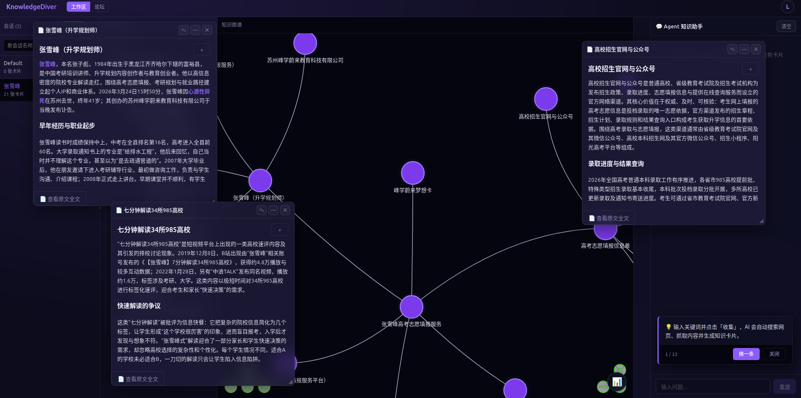
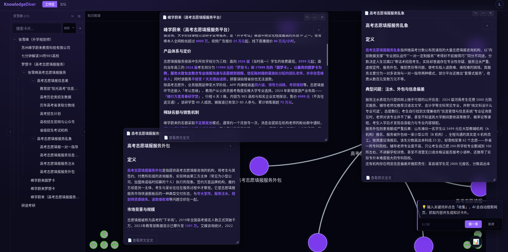
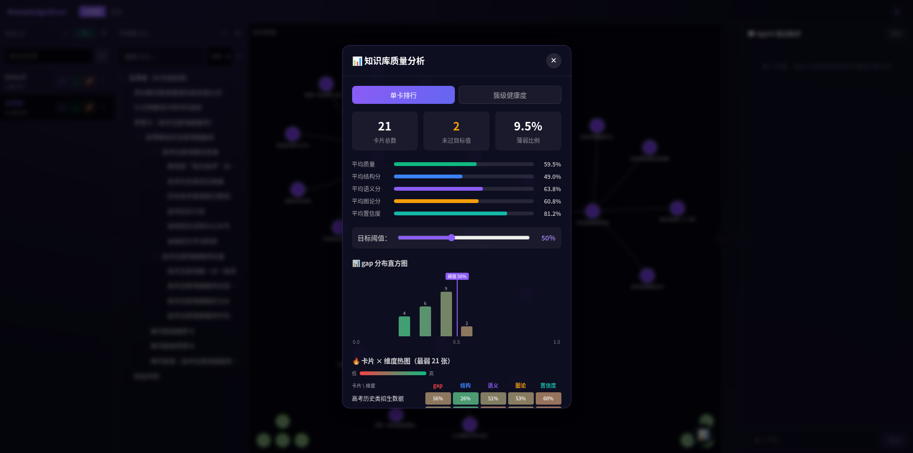
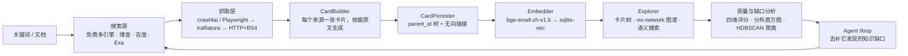

<div align="center">


# KnowledgeDiver

**给它一个关键词，还你一张知识图谱。**

它替你去搜、去读原文，把读到的内容写成 Wiki 风格的卡片，
编织成卡片树与可交互的图谱 —— 然后审计这张图，告诉你哪里还空着。

[](LICENSE)
[](https://www.python.org/)
[](https://nodejs.org/)
[](#常见问题)
[](https://github.com/TC635807/KnowledgeDiver/stargazers)

[English](README.en.md) · **简体中文** · [在线体验](https://knowledgediver.cloud) · [快速开始](#快速开始) · [工作原理](#工作原理)

[](https://knowledgediver.cloud)

<sub>卡片树 · 知识图谱 · Agent 助手 —— 点击进入在线体验</sub>

</div>

## 它做什么

给一个关键词，或者丢一份文档进去，剩下的它自己跑完：

```
关键词 / 文档
      │
  ⓐ   │  多引擎联网搜索      Bing · AnySearch · Exa-MCP · DuckDuckGo · SearXNG —— 不需要任何 API key
  ⓑ   │  三级抓取            浏览器渲染 → trafilatura → 轻量 HTML，哪条能通走哪条
  ⓒ   │  卡片生成            每个来源一张卡片，由你的 LLM 依据网页原文写成
  ⓓ   │  知识组织            显式 parent/child 卡片树 + Obsidian 风格的无向链接
  ⓔ   │  语义检索            本地嵌入模型 + sqlite-vec，512 维 cosine
  ⓕ   │  质量审计            四维质量分 → 缺口分 → 指出图谱哪里薄
  ⓖ   │  Agent 自治          /loop 自己去找薄弱处，然后去补
      ▼
一个可浏览、可编辑、可度量、可生长的知识库
```

每张卡片都保留生成它的**网页原文全文**，随时能回看来源，而不是"摘要的摘要"。

## 为什么是 KnowledgeDiver

- **它从"搜索"出发，而不是从"你的文件"出发。** 大多数"AI 知识库"在等你上传资料；
  KnowledgeDiver 自己出去找、读原文、把结果归档 —— 一个关键词加一次点击，就得到一个成网的知识库。
- **产物是能编辑的图谱，不是要你翻的聊天记录。** 卡片落在显式的父子树里，并以 Obsidian 风格互链
  （backlinks 对称维护、幂等）。vis-network 视图让你一眼看见自己知识的形状。
- **它会给自己打分。** 每张卡片四个维度评分 —— 结构完整度、图论信号、语义融入度、模型自评置信度；
  整个库还有 gap 分布直方图、维度热图，以及 HDBSCAN 聚类给出的 **薄弱 / 碎片化 / 覆盖不足**主题域诊断。
  "接下来该学什么"因此有一个不靠感觉的答案。
- **Agent 是来维护图谱的。** ReAct Agent 带 13 个工具，分读层 / 处方层 / 写层；`/loop` 会持续
  盯着最弱的卡片和簇去补，关掉标签页也不会中断。
- **本地优先是认真的。** 元数据走 SQLite，每个会话一个独立 SQLite 存卡片与原文，
  `bge-small-zh-v1.5` 在 CPU 上跑，向量存进 `sqlite-vec`。无需账号、无遥测，官方云端完全是可选项。

## 截图

| 知识图谱 + Agent 助手 | 卡片树 + 卡片详情 |
| --- | --- |
| [](https://knowledgediver.cloud) | [](https://knowledgediver.cloud) |

**质量与缺口分析** —— 四维评分、gap 直方图、维度热图、单卡排行与簇级健康度：



## 核心能力

**收集**

- **免费多引擎搜索** —— Bing / AnySearch / Exa-MCP / DuckDuckGo / SearXNG 按可配置的优先级依次尝试，
  直到某个引擎返回**真正与查询相关**的结果。不需要任何 API key。
- **三级抓取** —— 先 crawl4ai / Playwright（浏览器指纹），不通退 trafilatura，再退轻量 HTTP + BeautifulSoup。
- **相关性守门** —— 某引擎返回了一整页与查询无关的结果（Bing 找不到时会这样），一律按失败处理，
  回退链继续往下走，而不是停在一堆垃圾上。
- **遵守 robots.txt** —— 抓取前按域名检查，并在多轮运行中积累域名质量。
- **文档解析** —— txt / md / pdf / docx 会先做结构分析，再展开成根卡 / 章节卡 / 细节卡三层卡片树。

**组织**

- 卡片包含标题、Markdown 正文、元数据、来源 URL、标签与模型置信度。
- 树方向由显式 `parent_id` 承载；其上另有 Obsidian 风格的**无向链接**，backlinks 对称且幂等。
- 支持树形 / 最新 / 标题三种排序，可浏览交互式图谱，也能随时打开任意卡片背后的网页原文全文。

**检索**

- 本地计算 `bge-small-zh-v1.5` 嵌入并存入 `sqlite-vec`（512 维、cosine 距离）做语义搜索；
  新卡片自动向量化，启动时补齐缺失向量。
- 嵌入模型不可用时自动回退标题匹配。

**审计**

- 四个维度 —— 结构完整度、图论信号、语义融入度、LLM 自评置信度 —— 合成 `quality_score` 与 `gap_score`。
- 全库质量报告、最薄弱卡片排行、gap 分布直方图与维度热图。
- HDBSCAN 语义聚类做簇级健康度诊断，识别 weak / fragmented / undercovered 主题域。

**自动化**

- ReAct Agent，13 个工具分为读层 / 处方层 / 写层。
- `/loop` 自主迭代：持续评估薄弱卡片与薄弱簇，按需搜索、扩展、刷新、挂载。
- Agent 循环后台化 —— 刷新页面或断开 SSE 都不会取消任务，重连后回放进度。
- 写层工具连续失败会自动熔断。

**运维**

- 每次收集 / 扩展 / 刷新 / 文档分析都是一个 **Task**，通过 SSE 推送 `progress` / `card` /
  `complete` / `error` 事件，断线重连后可以回放。

## 快速开始

```bash
git clone https://github.com/TC635807/KnowledgeDiver.git
cd KnowledgeDiver
./start.sh          # Linux / macOS —— Windows 用 start.bat
```

然后打开 **http://localhost:3000**（后端在 `:8000`，开发态前端在 `:3000`）。

`start.sh` 幂等，自动处理最容易卡住的三件事：

1. 缺 `.env` 就从 `.env.example` 生成，并写入随机 `JWT_SECRET`；
2. 依赖缺失就安装 —— **先装 CPU 版 PyTorch**，避免多下 2.7GB 的 CUDA 依赖；
3. 缺嵌入模型就下载 `bge-small-zh-v1.5`（约 92MB，默认走 `hf-mirror` 镜像）。

**环境要求：** Python 3.10+、Node 18+。
**密钥：** 搜索与抓取完全不需要 key；只有**生成卡片**和**使用 Agent** 需要一个 OpenAI 兼容端点
（`AI_API_URL` / `AI_API_KEY` / `AI_MODEL`）—— 指向 Ollama 或其它本地服务，数据就一步都不出你的机器。

## 工作原理



每一级都是抽象接口，因此搜索源、抓取器、卡片生成器、嵌入器都可以单独替换，不影响流水线的其它部分。

| 模块 | 职责 |
| --- | --- |
| `backend/pipeline/` | 可组合流水线与 PipelineAPI |
| `backend/search/` | 搜索源适配（免费多引擎 / 博查 / 百度 / Exa） |
| `backend/scraper/` | 三级抓取、robots.txt、域名质量、URL 优先级 |
| `backend/ai/` | LLM 调用与本地嵌入模型 |
| `backend/agent/` | Agent 工具、循环、后台管理器 |
| `backend/quality/` | 质量评分、簇级评估、改进策略 |
| `backend/storage/` | 存储抽象与 SQLite 实现 |
| `frontend/src/` | React 界面：卡片树、图谱、收集器、Agent 抽屉、质量面板 |

## 配置

所有设置都在 `.env`（由 `.env.example` 生成，已被 git 忽略）。也可以直接在界面里改：
**右上角头像 → ⚙️ API 配置**，它会就地改写 `.env` 中对应的几行，**立即生效、无需重启**；
接口只返回脱敏后的 key，不会把密钥回传。

| 变量 | 默认值 | 说明 |
| --- | --- | --- |
| `AI_API_URL` | `https://ollama.com/v1` | 任意 OpenAI 兼容端点；填完整的 `/v1/responses` 地址也会自动规范化 |
| `AI_API_KEY` | 空 | 仅生成卡片与使用 Agent 时需要 |
| `AI_MODEL` | `deepseek-v4.1-flash` | 卡片生成与 Agent **共用**同一个模型 |
| `AI_CONCURRENCY` | `2` | LLM 并发上限 |
| `DEFAULT_SEARCH_PROVIDER` | `free` | `free` / `bocha` / `baidu` / `exa` |
| `FREE_SEARCH_ENGINES` | `exa-mcp,anysearch,bing,ddg,searxng` | 引擎优先级，从左到右 |
| `ANYSEARCH_API_KEY` | 空 | 可选，仅用于提高 AnySearch 匿名额度 |
| `BOCHA_API_KEY` | 空 | 仅 `provider=bocha` 时需要 |
| `MAX_CONCURRENT_TASKS` | `5` | 并发收集任务上限 |
| `KD_SERVER_URL` | `https://knowledgediver.cloud` | 可选的官方服务器，用于账号 / 论坛 / 迁移 |

> Bing 对中文多词查询会悄悄退化成"按第一个词搜"，所以默认引擎顺序把 `exa-mcp` 与 `anysearch` 排在前面。
> 按你所在网络调整 `FREE_SEARCH_ENGINES` 即可。

## 常见问题

**试用需要 API key 吗？** 不需要。搜索、抓取、卡片树、图谱、质量分析都能直接用；只有生成卡片和运行
Agent 才需要一个 LLM 端点。

**能完全离线 / 用本地模型吗？** 可以 —— 把 `AI_API_URL` 指向 Ollama、vLLM 或 LM Studio 即可；
嵌入模型本来就跑在本地。

**我的数据放在哪？** 只在项目目录里，不往别处去：`data/knowledgediver.db`（用户、会话、域名质量）、
`cards/{username}/{session_id}/session.db`（卡片、原文、向量）、`models/bge-small-zh-v1.5/`（模型权重）。
三者都已被 git 忽略。

**为什么 `start.sh` 要装 CPU 版 PyTorch？** 嵌入模型只做 CPU 推理，但 PyPI 上 Linux 版 `torch`
是 CUDA 构建，会连带装 16 个 `nvidia-*` 包（约 2.7GB，venv 从 1.8GB 膨胀到 5.7GB）。
脚本因此先装 CPU 版。确实需要 GPU 版就设 `TORCH_CPU_ONLY=0`。

**为什么我在 shell 里设的代理不生效？** 这是刻意的：出站请求只认你显式配置的代理
（`AI_PROXY_URL`、`PROXY_PORT`），忽略 `HTTP_PROXY` / `ALL_PROXY` 等环境变量 ——
这样"本地代理没开"不会连带把 AI 客户端和整条搜索链一起搞挂。`socks5://` 由 `socksio` 支持。

**它遵守 robots.txt 吗？** 遵守 —— 抓取前按域名检查并缓存结果。

**界面有英文吗？** 暂时没有：界面与代码注释目前都是中文，英文界面在路线图里，欢迎来帮忙翻译。

## 与同类项目的区别

KnowledgeDiver 既不是笔记编辑器，也不是聊天框。它是替你**建立并审计**知识库的那条流水线。
下面用各家自己的定位来做对照：

| 项目 | 它的定位 | KnowledgeDiver 的不同 |
| --- | --- | --- |
| [Reor](https://github.com/reorproject/reor) | "Private & local AI personal knowledge management app" | Reor 是你写字和思考的地方；KnowledgeDiver 负责出去收集。 |
| [Karakeep](https://github.com/karakeep-app/karakeep) | 可自托管的"什么都收藏"应用，带 AI 打标 | Karakeep 存你已经找到的东西；KnowledgeDiver 去搜、去抓、去写卡片。 |
| [Khoj](https://github.com/khoj-ai/khoj) | 在文档与网页之上做 AI 搜索 | Khoj 回答问题；KnowledgeDiver 产出结构化、可编辑的知识。 |
| [AnythingLLM](https://github.com/Mintplex-Labs/anything-llm) | 和文档聊天、Agent、多用户工作区 | 以聊天/工作区为中心；KnowledgeDiver 以图谱为中心，并且会审计自己的质量。 |
| [SiYuan](https://github.com/siyuan-note/siyuan) | 隐私优先的本地知识管理 | 同为本地优先；SiYuan 是块编辑器，KnowledgeDiver 是自动收集成图的系统。 |

*（上表中的定位描述均来自各项目自己的说法，最新情况请以它们的文档为准。）*

## 开源版与官方云服务

本仓库是完整可用的东西，全部跑在你自己的机器上。

| | 本仓库（自托管） | [knowledgediver.cloud](https://knowledgediver.cloud) |
| --- | --- | --- |
| 搜索 → 抓取 → 卡片 → 卡片树 → 图谱 | ✅ | ✅ |
| 语义搜索、质量与缺口分析 | ✅ | ✅ |
| Agent 与 `/loop` 自治 | ✅ | ✅ |
| 多设备会话同步与迁移 | — | ✅ |
| 账号与社区论坛 | — | ✅ |

云端只是个可选的便利：代码里只有 `KD_SERVER_URL` 一处指向它，留空即为纯本地模式。

本仓库不包含：商业化模块、内置密钥，以及上游项目的论文 / 专利 / 竞赛材料。

## 开发

```bash
cd tests/backend && pytest -v     # 后端
cd frontend && npm test           # 前端
```

`backend/` 是 FastAPI 应用 —— 路由很薄，逻辑在 `pipeline/`、`agent/`、`quality/`、
`scraper/`、`storage/` 里。`frontend/` 是 React 18 + TypeScript + Vite。

## 路线图

- [x] 搜索 → 抓取 → 卡片 → 卡片树与图谱流水线
- [x] 基于本地嵌入的语义搜索
- [x] 质量评分、缺口分析与簇级诊断
- [x] 带 `/loop` 自治能力的 ReAct Agent
- [ ] 英文界面与英文文档
- [ ] 更多可替换的搜索源与抓取器
- [ ] Obsidian / 纯 Markdown 的导入导出
- [ ] 可选的 GPU 嵌入后端

范围与优先级都可能调整 —— 欢迎用 issue 来讨论。

## 参与贡献

欢迎提 issue 和 PR。界面与代码注释目前是中文，但用英文写 PR 完全没有问题；
帮忙翻译界面也是一个很好的第一次贡献。**小而聚焦、并且带测试**的 PR 最容易合入。

如果这个项目对你有用，点个 ⭐ 能帮更多人看到它。

## License

MIT —— 见 [LICENSE](LICENSE)。
