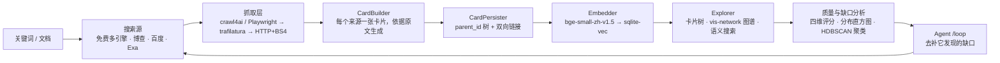

<div align="center">


# KnowledgeDiver

**输入一个关键词，自动搜索、抓取、生成知识卡片，并连成图谱。**

本地优先：卡片、嵌入模型和向量索引都在你自己的机器上。

[](LICENSE)
[](https://www.python.org/)
[](https://nodejs.org/)
[](#常见问题)
[](https://github.com/TC635807/KnowledgeDiver/stargazers)

[English](README.en.md) · **简体中文** · [在线体验](https://knowledgediver.cloud) · [快速开始](#快速开始) · [工作原理](#工作原理)

[](https://knowledgediver.cloud)

</div>

## 它做什么

给一个关键词，或者上传一份文档，它会：

1. 用免费的搜索引擎找候选网页（Bing / AnySearch / Exa-MCP / DuckDuckGo / SearXNG，不需要 API key）；
2. 抓取正文，优先用浏览器渲染，失败则退回 trafilatura 或轻量 HTML；
3. 用你配置的 LLM 为每个来源写一张卡片，正文依据网页原文而不是网页摘要；
4. 按 `parent_id` 组织成卡片树，并在卡片之间建立双向链接；
5. 用本地嵌入模型建向量索引，支持语义搜索；
6. 给每张卡片打分，统计全库的缺口分布，指出哪些主题还很薄；
7. 需要时用 Agent 的 `/loop` 模式自动去补这些缺口。

每张卡片都保存抓取到的网页全文，可以随时回看来源。

## 截图

| 知识图谱 + Agent 助手 | 卡片树 + 卡片详情 |
| --- | --- |
| [](https://knowledgediver.cloud) | [](https://knowledgediver.cloud) |

质量与缺口分析，包含四维评分、gap 分布直方图、维度热图、单卡排行和簇级健康度：


## 功能

**搜索与抓取**

- 免费多引擎搜索，不需要 API key，引擎优先级可配置
- 三级抓取：crawl4ai / Playwright，退回 trafilatura，再退回 HTTP + BeautifulSoup
- 引擎返回的结果与查询无关时按失败处理，继续试下一个引擎
- 抓取前检查 robots.txt，并记录域名质量
- 支持 txt / md / pdf / docx，按结构拆成根卡、章节卡、细节卡

**卡片与图谱**

- 卡片包含标题、Markdown 正文、来源 URL、标签和模型置信度
- 卡片树由 `parent_id` 承载，另有 Obsidian 风格的双向链接，backlinks 对称维护
- 树形 / 最新 / 标题三种排序，vis-network 交互式图谱，可查看原文全文

**语义搜索**

- `bge-small-zh-v1.5` 本地嵌入 + `sqlite-vec`，512 维 cosine 距离
- 新卡片自动建索引，启动时补齐缺失向量
- 嵌入模型不可用时退回标题匹配

**质量分析**

- 四个维度：结构完整度、图论信号、语义融入度、LLM 自评置信度
- 全库质量报告、最薄弱卡片排行、gap 分布直方图、维度热图
- HDBSCAN 聚类诊断簇级健康度，标出薄弱、碎片化、覆盖不足的主题域

**Agent**

- ReAct Agent，13 个工具分读层、处方层、写层
- `/loop` 模式持续处理评分最低的卡片和簇
- 后台运行，刷新页面或断开 SSE 都不会中断，重连后回放进度
- 写层工具连续失败会自动熔断

**任务**

- 每次收集、扩展、刷新、文档分析都是一个 Task，通过 SSE 推送进度、卡片、完成、错误事件

## 快速开始

```bash
git clone https://github.com/TC635807/KnowledgeDiver.git
cd KnowledgeDiver
./start.sh          # Linux / macOS；Windows 用 start.bat
```

打开 **http://localhost:3000**。后端在 `:8000`，开发态前端在 `:3000`。

`start.sh` 是幂等的，会处理三件容易卡住的事：

1. 缺 `.env` 就从 `.env.example` 生成，并写入随机 `JWT_SECRET`；
2. 缺依赖就安装，先装 CPU 版 PyTorch，避免多下 2.7GB 的 CUDA 包；
3. 缺嵌入模型就下载 `bge-small-zh-v1.5`（约 92MB，默认走 hf-mirror 镜像）。

环境要求 Python 3.10+ 和 Node 18+，完整安装约 2.8GB。

搜索和抓取不需要任何 key。只有生成卡片和使用 Agent 需要一个 OpenAI 兼容端点
（`AI_API_URL` / `AI_API_KEY` / `AI_MODEL`），指向 Ollama 或其它本地服务即可。

## 工作原理



每一级都是抽象接口，搜索源、抓取器、卡片生成器、嵌入器都可以单独替换。

| 模块 | 职责 |
| --- | --- |
| `backend/pipeline/` | 可组合流水线与 PipelineAPI |
| `backend/search/` | 搜索源适配（免费多引擎 / 博查 / 百度 / Exa） |
| `backend/scraper/` | 三级抓取、robots.txt、域名质量、URL 优先级 |
| `backend/ai/` | LLM 调用与本地嵌入模型 |
| `backend/agent/` | Agent 工具、循环、后台管理器 |
| `backend/quality/` | 质量评分、簇级评估、改进策略 |
| `backend/storage/` | 存储抽象与 SQLite 实现 |
| `frontend/src/` | React 界面：卡片树、图谱、收集器、Agent 抽屉、质量面板 |

## 配置

配置都在 `.env`（由 `.env.example` 生成，已被 git 忽略）。也可以在界面上改：
右上角头像 → API 配置，它会就地改写 `.env` 里对应的几行，改完立即生效，不用重启。
接口只返回脱敏后的 key。

| 变量 | 默认值 | 说明 |
| --- | --- | --- |
| `AI_API_URL` | `https://ollama.com/v1` | 任意 OpenAI 兼容端点，填完整的 `/v1/responses` 地址也会自动规范化 |
| `AI_API_KEY` | 空 | 仅生成卡片和使用 Agent 时需要 |
| `AI_MODEL` | `deepseek-v4.1-flash` | 卡片生成与 Agent 共用同一个模型 |
| `AI_CONCURRENCY` | `2` | LLM 并发上限 |
| `DEFAULT_SEARCH_PROVIDER` | `free` | `free` / `bocha` / `baidu` / `exa` |
| `FREE_SEARCH_ENGINES` | `exa-mcp,anysearch,bing,ddg,searxng` | 引擎优先级，从左到右 |
| `ANYSEARCH_API_KEY` | 空 | 可选，仅用于提高 AnySearch 匿名额度 |
| `BOCHA_API_KEY` | 空 | 仅 `provider=bocha` 时需要 |
| `MAX_CONCURRENT_TASKS` | `5` | 并发收集任务上限 |
| `KD_SERVER_URL` | `https://knowledgediver.cloud` | 可选的官方服务器，用于账号、论坛、迁移 |

默认引擎顺序把 `exa-mcp` 和 `anysearch` 排在前面，是因为 Bing 对中文多词查询会退化成只搜第一个词。
按你所在的网络调整 `FREE_SEARCH_ENGINES` 即可。

## 常见问题

**试用需要 API key 吗？** 不用。搜索、抓取、卡片树、图谱、质量分析都能直接跑，只有生成卡片和运行 Agent
需要一个 LLM 端点。

**能完全离线吗？** 可以。把 `AI_API_URL` 指向 Ollama、vLLM 或 LM Studio 就行，嵌入模型本来就跑在本地。

**我的数据存在哪？** 都在项目目录里：`data/knowledgediver.db`（用户、会话、域名质量）、
`cards/{username}/{session_id}/session.db`（卡片、原文、向量）、`models/bge-small-zh-v1.5/`（模型权重）。
三个位置都已被 git 忽略。

**为什么 `start.sh` 要先装 CPU 版 PyTorch？** 嵌入模型只做 CPU 推理，但 PyPI 上 Linux 版 `torch` 是
CUDA 构建，会连带装 16 个 `nvidia-*` 包（约 2.7GB，venv 从 1.8GB 涨到 5.7GB）。需要 GPU 版就设
`TORCH_CPU_ONLY=0`。

**为什么我在 shell 里设的代理不生效？** 出站请求只认显式配置的代理（`AI_PROXY_URL`、`PROXY_PORT`），
忽略 `HTTP_PROXY` / `ALL_PROXY` 这类环境变量，这样本地代理没开时不会连带把 AI 客户端和整条搜索链一起搞挂。
`socks5://` 由 `socksio` 支持。

**会遵守 robots.txt 吗？** 会，抓取前按域名检查并缓存结果。

**界面有英文吗？** 暂时只有中文。界面和代码注释都是中文，英文界面在路线图里。

## 与同类项目的区别

它不是笔记编辑器，也不是聊天框。卡片和树是自动收集出来的，不是手写的。主要精力放在收集、成图和审计全库质量上。

下表用各家自己的定位做对照：

| 项目 | 它的定位 | 与 KnowledgeDiver 的区别 |
| --- | --- | --- |
| [Reor](https://github.com/reorproject/reor) | "Private & local AI personal knowledge management app" | Reor 面向手写笔记，KnowledgeDiver 面向自动收集 |
| [Karakeep](https://github.com/karakeep-app/karakeep) | 可自托管的书签与收藏应用，带 AI 打标 | Karakeep 保存你已经找到的内容，KnowledgeDiver 主动去搜和抓 |
| [Khoj](https://github.com/khoj-ai/khoj) | 在文档与网页之上做 AI 搜索 | Khoj 以问答为主，KnowledgeDiver 产出可编辑的卡片和树 |
| [AnythingLLM](https://github.com/Mintplex-Labs/anything-llm) | 和文档聊天、Agent、多用户工作区 | AnythingLLM 以对话和工作区为中心，KnowledgeDiver 以图谱和全库质量为中心 |
| [SiYuan](https://github.com/siyuan-note/siyuan) | 隐私优先的本地知识管理 | 同为本地优先；SiYuan 是块编辑器，KnowledgeDiver 是自动收集成图的工具 |

表中定位描述来自各项目自己的说法，最新情况请以它们的文档为准。

## 开源版与官方云服务

本仓库的功能都在你自己的机器上运行。

| | 本仓库 | [knowledgediver.cloud](https://knowledgediver.cloud) |
| --- | --- | --- |
| 搜索、抓取、卡片、卡片树、图谱 | ✅ | ✅ |
| 语义搜索、质量与缺口分析 | ✅ | ✅ |
| Agent 与 `/loop` | ✅ | ✅ |
| 多设备会话同步与迁移 | — | ✅ |
| 账号与社区论坛 | — | ✅ |

云端是可选的，代码里只有 `KD_SERVER_URL` 一处指向它，留空就是纯本地模式。

本仓库是从内部完整系统剥离出的核心代码版，不包含商业化模块、内置密钥，以及论文、专利、竞赛材料。

## 开发

```bash
cd tests/backend && pytest -v     # 后端
cd frontend && npm test           # 前端
```

`backend/` 是 FastAPI 应用，路由很薄，逻辑在 `pipeline/`、`agent/`、`quality/`、`scraper/`、
`storage/` 里。`frontend/` 是 React 18 + TypeScript + Vite。

## 路线图

- [x] 搜索 → 抓取 → 卡片 → 卡片树与图谱流水线
- [x] 基于本地嵌入的语义搜索
- [x] 质量评分、缺口分析与簇级诊断
- [x] 带 `/loop` 的 ReAct Agent
- [ ] 英文界面与英文文档
- [ ] 更多可替换的搜索源与抓取器
- [ ] Obsidian / Markdown 导入导出
- [ ] 可选的 GPU 嵌入后端

优先级可能调整，欢迎用 issue 讨论。

## 参与贡献

欢迎提 issue 和 PR。界面和代码注释目前是中文，用英文写 PR 没问题，帮忙翻译界面也很好。
小而聚焦、带测试的 PR 最容易合入。

如果这个项目对你有用，点个 ⭐ 能让更多人看到它。

## License

MIT，见 [LICENSE](LICENSE)。
